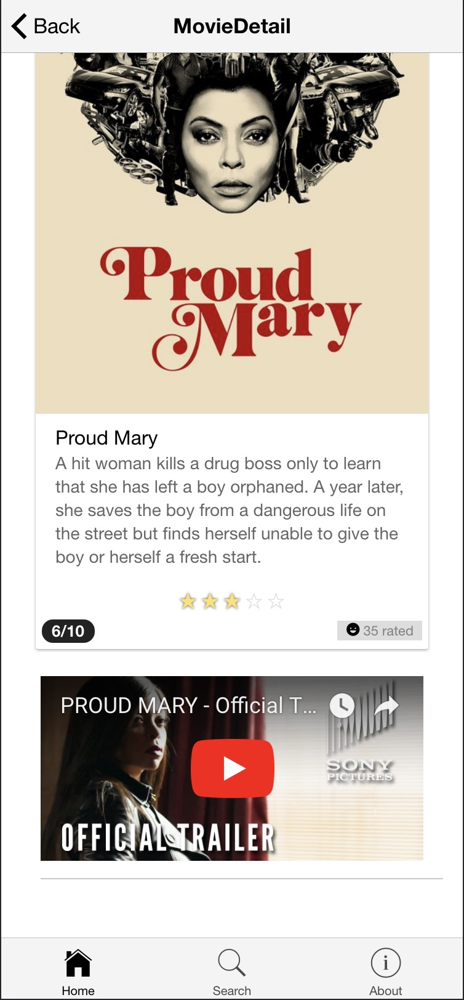
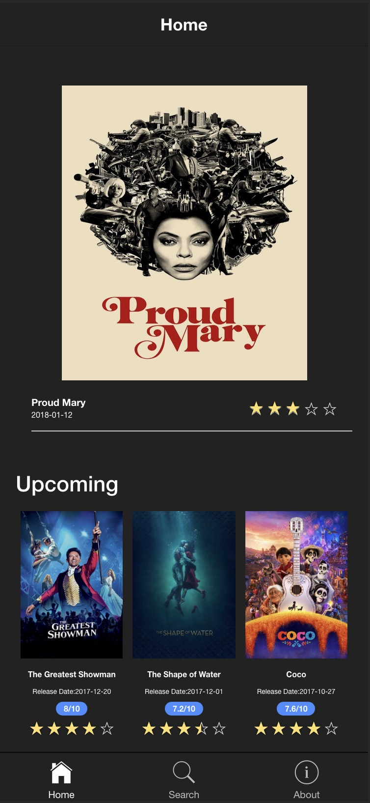
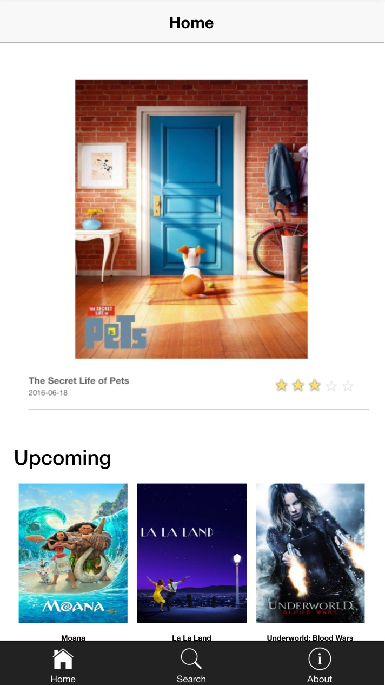
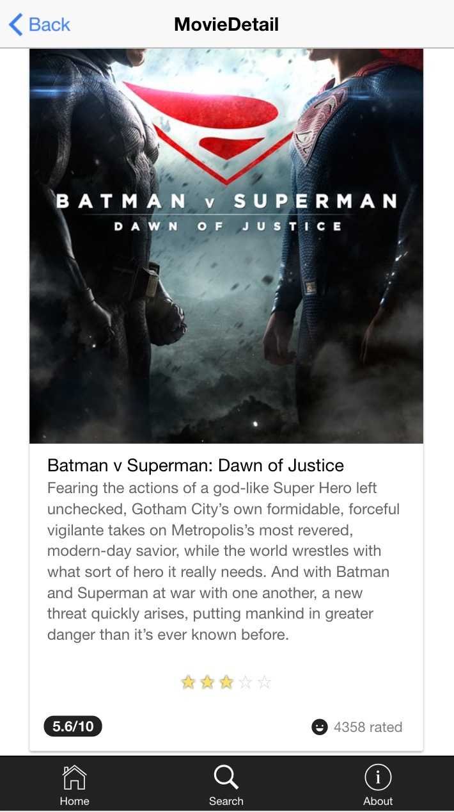
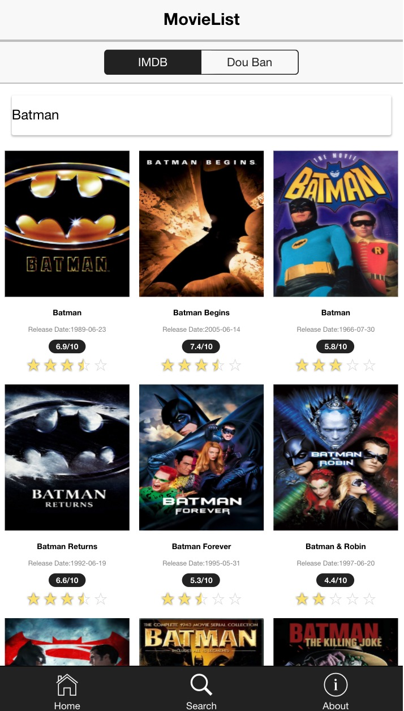

-#MovieSearch with ionic 2
---
---
##16/10/2017 UPDATED
1. Updated to latest ionic version
2. Added youtube video trailer function for each movie



---
---
##14/02/2017 UPDATED

1. Added two them styles (dark and light).
2. Fixed some layout bugs.

### Dark Style

### lignt Style


---
---

###How to use
```
npm install
```
then
```
ionic serve
```
or
```
ionic run ios
```
or 
```
ionic run android
```
### Home Page

### Movie Detail Page

### Search Page

